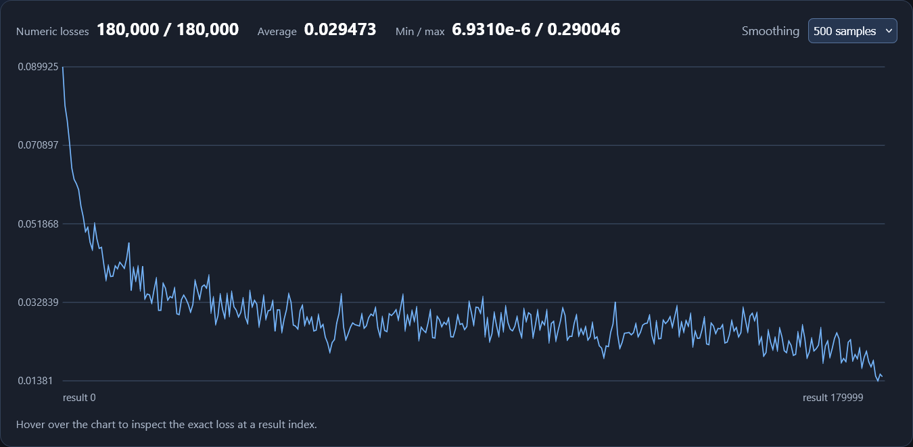

# Classifier
I finished it, at least well enough that it gets 89% accuracy on the 10k testing images. But I did this with a simple network of one hidden layer with 10 nodes. I also only trained with a single "epoch", going over the training data just one time. So before finishing this, I think I'll try seeing what happens when I tweak the training and layers/node counts.

## Baseline
layers_definition = [len(training_images[0]), 10, 10]
This layer setup with one epoch resulted in:
    results: 49511/60000
    accuracy: 83.0%

And:
    results: 8917/10000
    accuracy: 89.0%
    On the testing data

fig. 1

## More Epochs
Same original layers setup, but this time with 3 epochs. Somehow it did no better than the single epoch on the training. 

Training:
    results: 147988/180000
    accuracy: 82.0%

Testing:
    results: 9058/10000
    accuracy: 91.0%

But it did a bit better than before on the testing data. Based on the results file I can also see that it reached a lower average loss.

fig. 2

## Additional Layers
Now with an extra layer with 20 nodes and still a single training epoch:
layers_definition = [len(training_images[0]), 10, 20, 10]

Training:
    results: 49276/60000
    accuracy: 82.0%

Testing:
    results: 8932/10000
    accuracy: 89.0%

So basically no change. What about 4 more layers?
layers_definition = [len(training_images[0]), 10, 10, 10, 10, 20, 10]

Training:
    results: 34620/60000
    accuracy: 57.99999999999999%

Testing:
    results: 7722/10000
    accuracy: 77.0%

Well that did pretty poorly in training, but somehow still decent with the testing data. I imagine this means it took longer to get good, but was starting to do so by the end.

## Combining
Now, what happens if I use multiple epochs with a larger network?
layers_definition = [len(training_images[0]), 32, 32, 32, 32, 32, 10]

Training:
    Completed epoch 5/5
    results: 267962/300000
    accuracy: 89.0%
Best results with training. Although considering I did 5 epochs, I guess it's not surprising.

Also had the lowest loss after training.

Testing:
    results: 9461/10000
    accuracy: 95.0%

And by far the best testing result.

## Conclusion
Well I guess I can say that more, larger layers seems to have improved the classifier. And training for a longer time also helps. Actually, it'd be more accurate to say that you want as many layers as reasonably possible. The reasonability coming from how long you can train it for without overfitting and without taking too long. It's also tempting to try throwing this neural network strategy at everything.

# CNNs
Convolutional neural networks. Operate in the same way functionally. You give it an image and it can output an option for each possible thing it could be. Difference is that the initial layer is not fully connected. Instead each node in the first hidden layer is only given a part of original image. The amount of pixels that each node is given is the same throughout the layers though. Also the weights across a given layer are always the same. If we have a 3x3 node input size, then you can think of that layer as having only 9 weights. Connections to subsequent hidden layer nodes follow the same pattern of taking in a fixed amount of inputs like 3x3. Biggest benefit of CNNs are the vastly reduced amount of weights. If each layer now only has say 9 weights, that is so much less computation needed, even with more layers. With a fully connected graph a 64x64 image would require 4096 weights in the initial hidden layer per node. Now that same image would require a lot of nodes in the initial layer, but only ever n amount of weights. Also the biases of every node are also shared on a per layer basis. 

Actually I might have had a few misconceptions about CNNs here. While the layers do use shared weights, I had forgotten about the kernel part. The kernel refers to the grid of weights. And you can have multiple of those grids per layer. Process goes:
- create weight grids/kernels
- go over image in "patches", pixel grids of the same size as the kernels
- do dot product between patch and kernel
- the product becomes the output for the node