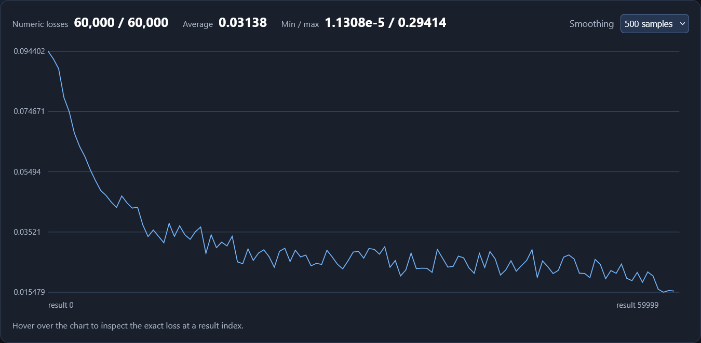
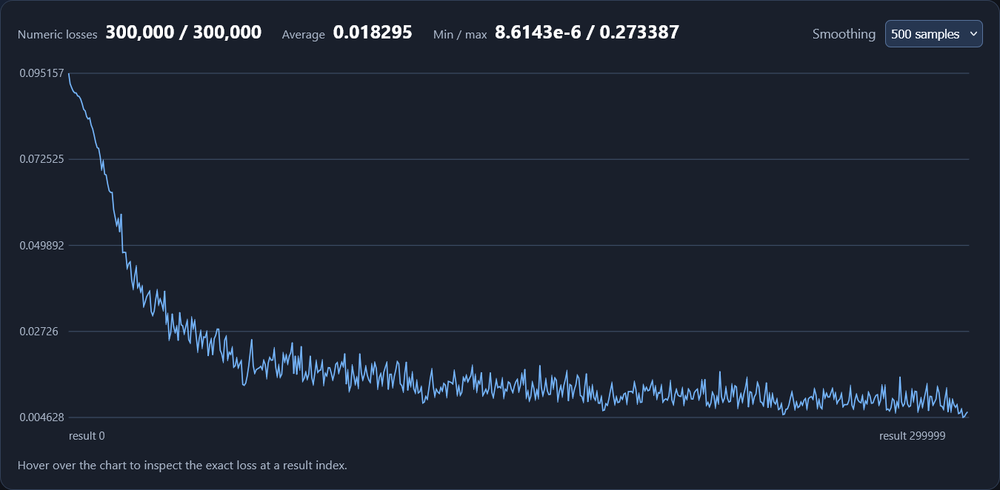

Where to begin? I guess the architecture?

# I/O
I know that the input is going to be a string. It likely needs to be a fixed size. It makes sense for the string to be converted to tokens. Say 10k? I'm assuming that is also what determines the "context" limit. Because the conversation history is fed back into the model as input. And when you exceed that limit you have to trim or summarize the context. Output is going to consist of tokens as well. However it will only be one. Actually, while it will be a single token output, it will technically be a list/vector where each number is the probability of outputting that token. Those numbers will be logits and then I'll use softmax or sigmoid to convert to a probability. Also I can only deal with numbers for the inputs, so what does it mean to convert strings into tokens? 
I also realize technically anything can be output or input. There just has to be a mapping between what number corresponds to which character, and which index of the logits vector corresponds to which character. And all the charcaters given as input are turned into numbers. 
A -> 1, B -> 2, etc. 
When I look at the logit vector, I also use my map, and I guess if I have each character map to a number, incrementing by one, I can use the same map. 

## Token Set
It's probably easiest to have the tokens all just be single charaters. Or use everything that appears in the training texts at least 100 times. 

# The "Function"/Network
Any neural network can be represented as a single function. The only truly independent variable is the input.
output is y, input is x, weights are W, b are biases, and f is the network/function itself
y = f(x, W, b)

## Nodes
The network has nodes which are spread across layers. Each layer contains a certain amount of nodes. And each node contains weights and has a bias. The nodes themselves can also be thought of as functions. Nodes take in a list of inputs and outputs a single value. The formula for each node is actually pretty simple.

inputs = [1, 2, 3]
weights = [0.5, 0.1, 0.2]
bias = 0.3
intermediary_value = inputs.dot_product(weights) + bias
Then you take that intermediary value and put it through an "activation function" to get your final output value.
output = activation(intermediary_value)

What is the purpose of the activation function?
"Any linear combination of linear functions results in a linear function, and thus having more of them doesn't help to model nonlinear relationships". I guess it kind of allows you to fine tune things better. If you had a fully linear network, all your outputs are forced to scale linearly too. If you have a super simple model with a single input and a single output, a linear network would mean the step is constant. But say for input x = 1, you want the model to output 2. And for input x = 2, you want to output 3. That can work, but now if x = 3, and you want 10? I don't think it's possible.

## Constraints
You have x amount of input values. You have y amount of output values. And each node takes in x inputs, but outputs only 1 value. At the very least, you need y nodes so that each output can have a value. I suppose you could technically have a single node connected to each output, but I think that defeats the purpose. You also have a lot of flexibility with the first layer. I mean all the inputs could connect to a single node? Although if you do that you'll be forced to have that one value continue along to get back to y outputs. So subsequent nodes would be receiving the same values as inputs.

I'm wondering what the best amount of layers or nodes per layer is. I guess if you have more it means more precision? More "parameters" to adjust means more possible values. But more parameters to adjust also means more training that must be done.
Depth (more layers) provides "feature learning", so it benefits models which require identifiying features. I remember seeing an example where each layer did map to a different feature. And they could tell by seeing the values of each layer when given input belonging to a particular category or having a certain feature. Width (more nodes) is apparently better for "many independent variations or features". I guess maybe if there's too many things, each node instead is what identifies features. Having more layers and nodes makes it more likely to overfit the training data. Well actually it's only likely if it has too many nodes relative to the amount of training data. 

## Training
The network is initialized with random weights and biases. At this point, all outputs are just random noise, with no correlation to the input. And you also need a way of adjusting those weights and biases. That adjustment comes from comparing the difference in your model's output and the expected output. Since these are both just going to be numbers, it's easy to determine the "loss", or how off your model was. If I was trying to classify numbers and I output [0.1, 0.1, 0.8], where each index corresponds to 1, 2, and 3, and I was expecting '1', I would be pretty far off. The exact loss here I guess could be calculated by expecting an array of [1, 0, 0]. And then you have to go through the process of "backpropagation" where you adjust each weight and bias by using calculus? 

## Loss
There's not actually one singular way of calculating loss. You just use a "loss function". Common loss functions include Mean Squared Error and Cross-Entropy Loss. MSE Is pretty simple. Going back to the example of [0.1, 0.1, 0.8] as the output, and [1, 0, 0] as the expected output.
o = [0.1, 0.1, 0.8]
e = [1, 0, 0]

MSE:
L = 1/len(o) * ((0.1 - 1)^2 + (0.1 - 0)^2 + (0.8 - 0)^2) = 0.486

Cross-Entropy Loss:
L = -(1 * log(0.1) + 0 * log(0.1) + 0 * log(0.8)) = 1

And now that the loss is obtained, you do backpropagation.

## Backpropagation
We know how much we were off by with the loss, but how do we adjust all our parameters? And by how much? I need to know what happens if I change one weight by a small amount. Does the loss get smaller or bigger?

The whole network is essentially just a bunch of nested functions. I can take the partial derivative of this large function with respect to just one weight. Partial derivative is just a derivative but all the other variables that you aren't differentiating with respect to are treated as constants. But because the loss function is a bunch of nested functions, taking the derivative of whole composite function is the product of the derivatives of each step. 
If the weight changes, now the node's output changes, if the node's output changes, now the output changes, and if the output changes, now the loss changes.
So, ∂L/∂w = ∂L/∂a * ∂a/z * ∂z/∂w. Technically, you do need the derivative of each weight or bias of the loss function. 
The calculations are kind of confusing. Some derivatives (∂L/∂a, ∂a/z, or ∂z/∂w) might require differentiating ReLU for example. I think one key thing to remember is that nothing is ever truly just a single value. Everything except for the target output comes from some function.  

### Gradient
∂L/∂w is the gradient/slope. Thinking back to basic functions, I remember that functions have slopes. A completely linear function has the same slope for all x. f(x) = 2x. The derivative would be 2. This means that for that function, increasing x by 1 results in the y (output) increasing by 2. And decreasing x by 1 results in the output decreasing by 2. Going back to the loss function, with our gradient we now know how much the loss will change if we adjust that weight. If the gradient is positive, it means increasing the weight will increase the loss/error and vice-versa. Now you know whether to increase or decrease the weight/bias, but you need to know by how much to change it. If you change it by too much, you might end up missing the optimal point and just end up going back and forth. You're goal is to find the max/min. But if you change it by too little, you could get stuck in a local max/min and miss the best possible value for minimizing loss. You adjust by multiplying the gradient by a learning rate and then subtracting it from the weight/bias. Much of the derivative calcuations remain the same per backprop. The derivatives involving the node outputs other than the last one with respect to the weight or bias are the same and don't need to be recalculated. 

# Classifier
I finished it, at least well enough that it gets 89% accuracy on the 10k testing images. But I did this with a simple network of one hidden layer with 10 nodes. I also only trained with a single "epoch", going over the training data just one time. So before finishing this, I think I'll try seeing what happens when I tweak the training and layers/node counts.

## Baseline
layers_definition = [len(training_images[0]), 10, 10]
This layer setup with one epoch resulted in:
    results: 49511/60000
    accuracy: 83.0%

And:
    results: 8917/10000
    accuracy: 89.0%
    On the testing data

fig. 1

## More Epochs
Same original layers setup, but this time with 3 epochs. Somehow it did no better than the single epoch on the training. 

Training:
    results: 147988/180000
    accuracy: 82.0%

Testing:
    results: 9058/10000
    accuracy: 91.0%

But it did a bit better than before on the testing data. Based on the results file I can also see that it reached a lower average loss.

fig. 2

## Additional Layers
Now with an extra layer with 20 nodes and still a single training epoch:
layers_definition = [len(training_images[0]), 10, 20, 10]

Training:
    results: 49276/60000
    accuracy: 82.0%

Testing:
    results: 8932/10000
    accuracy: 89.0%

So basically no change. What about 4 more layers?
layers_definition = [len(training_images[0]), 10, 10, 10, 10, 20, 10]

Training:
    results: 34620/60000
    accuracy: 57.99999999999999%

Testing:
    results: 7722/10000
    accuracy: 77.0%

Well that did pretty poorly in training, but somehow still decent with the testing data. I imagine this means it took longer to get good, but was starting to do so by the end.

## Combining
Now, what happens if I use multiple epochs with a larger network?
layers_definition = [len(training_images[0]), 32, 32, 32, 32, 32, 10]

Training:
    Completed epoch 5/5
    results: 267962/300000
    accuracy: 89.0%
Best results with training. Although considering I did 5 epochs, I guess it's not surprising.

Also had the lowest loss after training.

Testing:
    results: 9461/10000
    accuracy: 95.0%

And by far the best testing.

## Conclusion
Well I guess I can say that more, larger layers seems to have improved the classifier. And training for a longer time also helps. Actually, it'd be more accurate to say that you want as many layers as reasonably possible. The reasonability coming from how long you can train it for without overfitting and without taking too long. It's also tempting to try throwing this neural network strategy at everything.